# 引言
>在我从网络上接触的毕业设计来看,很多都是类似后台管理以表格的形象展示数据.在毕设演示环节不够突出,所以我采用的是以用户操作视角去设计考试平台,参考了一下\*\*通（￣︶￣）

>为什么会以考试系统作为毕设,主要我们学校也有个考试系统,体验不太好,所以想写下,有时我就在想,学校有那么多老师,还有实训之类的课程,老师就不创新下,去以学校中用到的功能去让我们完成实训课程,有成就感才会感兴趣啊!天天拿着书上的案例写，累不累啊!采用这样的学习方式还能不断的迭代,技术迭代的那么快,就让一届一届学生去迭代不好吗,学校的这种学习方式很死板,也不公平,为了让大部分人不挂科,不管会不会的学生,背背都能过,差距也不大，甚至更好,让那些有水平的同学在评优评奖，哎~~~不说了§(*￣▽￣*)§

>还有一部分让我不满意的是学校采用的第三方平台,也不考虑下学生隐私信息,有的还需要实名认证,比如P\*,还有之前\*\*通,报道的信息泄露问题,还有就是不能忍的事情,就是啥希平台,找回密码,竟然把密码直接通过邮箱发给我,笑死.但我肯定的是他们的系统处理密码,要么没加密,要么就是对称加密,要么我也不知道/(ㄒoㄒ)/~~,
# 为考-考试平台

毕业设计：为考-考试系统，后端采用`Spring Cloud`，前端采用`Vue` 3，存储采用`Mysql`，缓存采用`Redis`。完成基本的考试功能。完成了遗传算法自动组卷、文本批量导入题库，邀请码加入课程、数据可视化等一系列前后端功能。悄悄的说一下，如果你觉得本项目还凑合，可以给个`Star` q(≧▽≦q)

## 说明
本项目为本人毕业设计，未经许可，不可用于任何商业用途。禁止通过该项目进行毕设项目买卖

第一次接触`SpringBoot`和`SpringCloud`，为了尽快的完成该项目，很多功能没有进行太多的规划和测试，代码逻辑较乱。只实现了主要功能,本来是想写个学习平台的.但是范围太大,不太好完成.所以就完成了其中的考试功能.

如果你想以本项目做毕设，我建议你可以以完成其他模块入手或者完成本项目没有完成的功能、待优化的功能，如后台管理、错题本，笔记。可以去体验下**通，找找思路，不建议直接使用本项目，毕设应该自己去动动手，这将会是你那简历中挺好的一个经验吧~。哎~不过找工作还是好难~~~找不到啊！找前端，哎，后端吧，东西太多记不住，其实我感觉就是人太多，投简历人家都看不见吧~，还有就是自己的基础不牢靠，会模仿着实现一些功能，但很多知识记不住啊！面向百度编程啊！

## 介绍
###  项目地址

#### 为考-考试平台-前端：

Gitee：[https://gitee.com/for-the-exam/exam-web](https://gitee.com/for-the-exam/exam-web)

Github：[https://github.com/baymaxsjj/exam-web](https://github.com/baymaxsjj/exam-web)

#### 为考-考试平台-后端：

Gitee：[https://gitee.com/for-the-exam/exam](https://gitee.com/for-the-exam/exam)

Github：[https://github.com/baymaxsjj/exam](https://github.com/baymaxsjj/exam)

#### 数据库数据填充工具：

专为此项目写的工具，为了给数据库填充点数据，好测试。其实也是为了毕设演示环节有更多的数据进行展示。测试和展示都很好用的工具，可以在你的项目上试试啊！

Gitee：[https://gitee.com/baymaxsjj/sqlmock](https://gitee.com/baymaxsjj/sqlmock) 

Github：[https://gitee.com/baymaxsjj/sqlmock](https://gitee.com/baymaxsjj/sqlmock)

### 系统截图

<table>
    <tr>
        <td></td>
        <td></td>
         <td>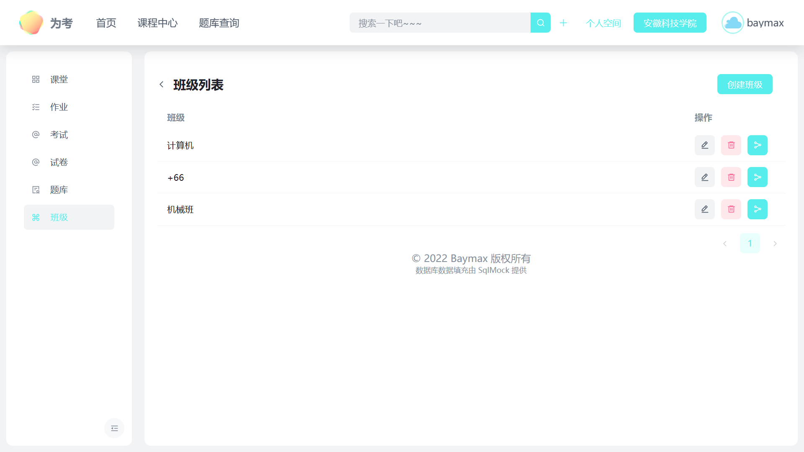</td>
         <td>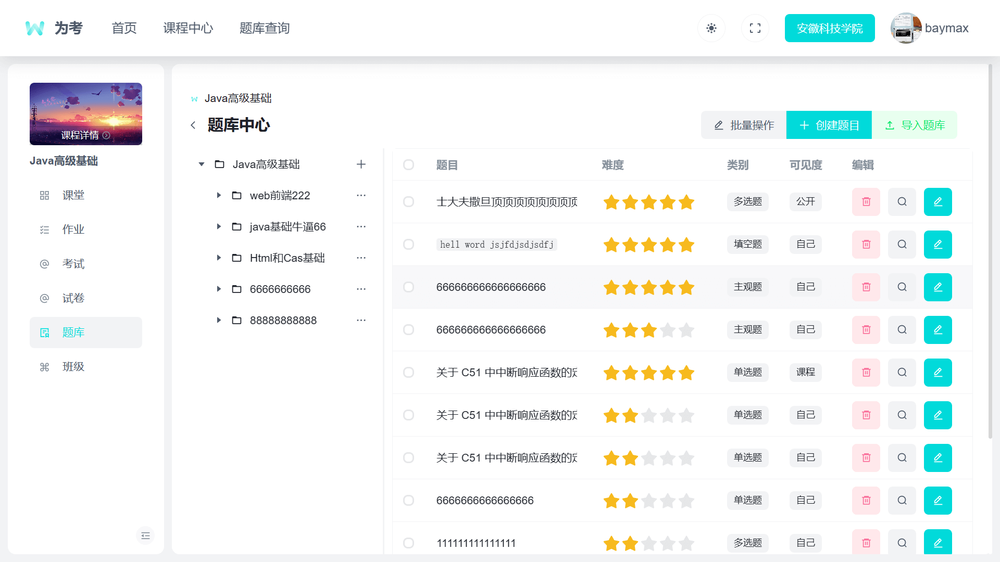</td>
    </tr>
    <tr>
        <td>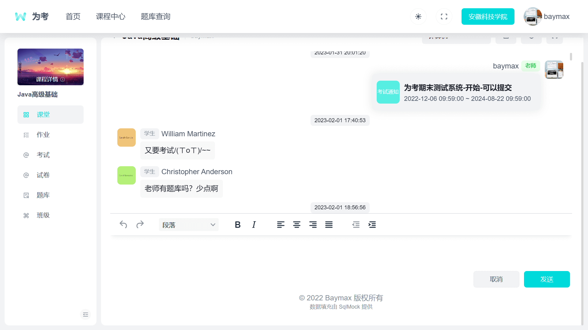</td>         
        <td>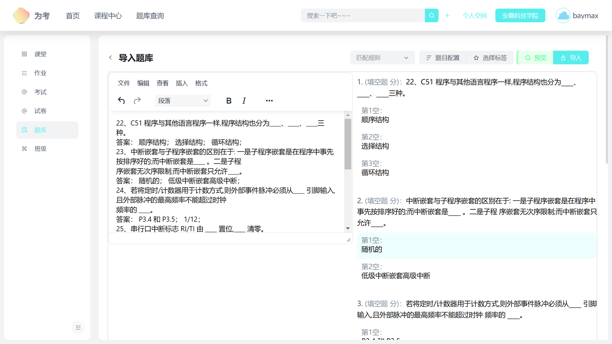</td>
         <td>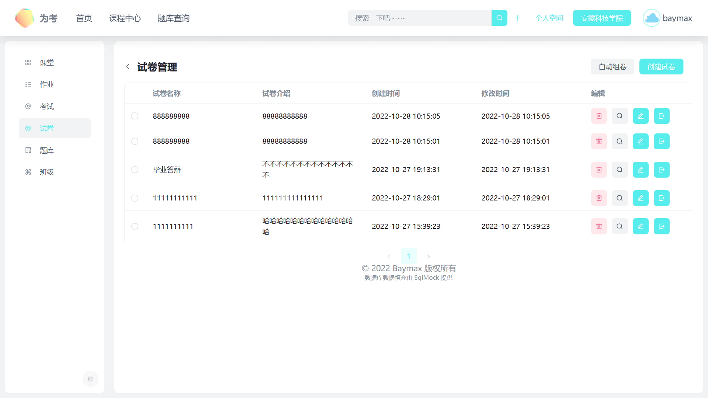</td>
         <td>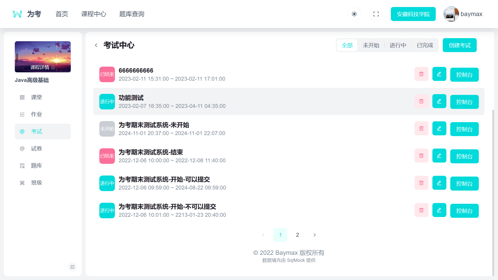</td>
    </tr>
    <tr>
        <td>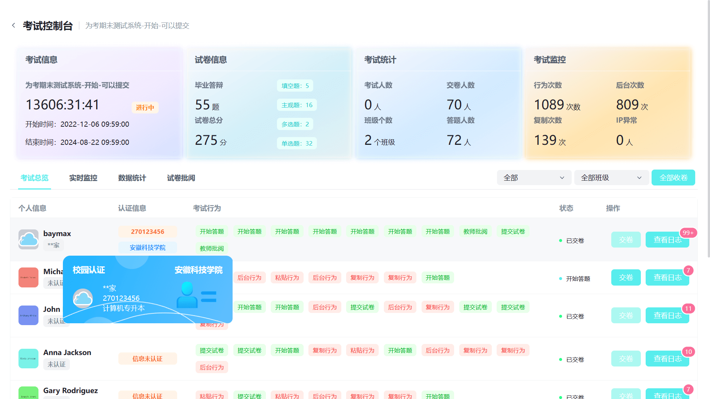</td>
        <td>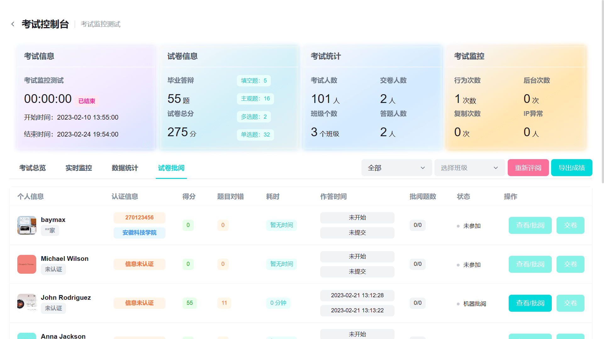</td>
         <td>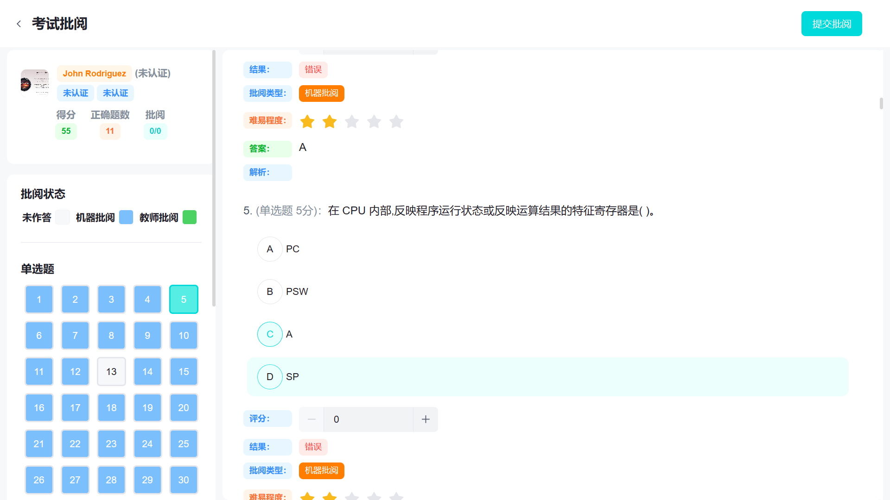</td>
         <td>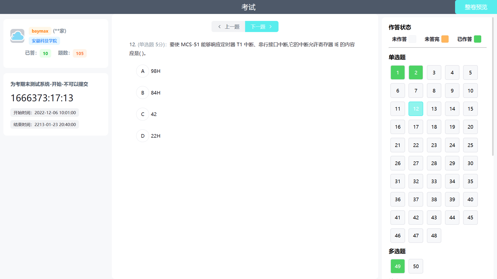</td>
    </tr>
     <tr>
        <td>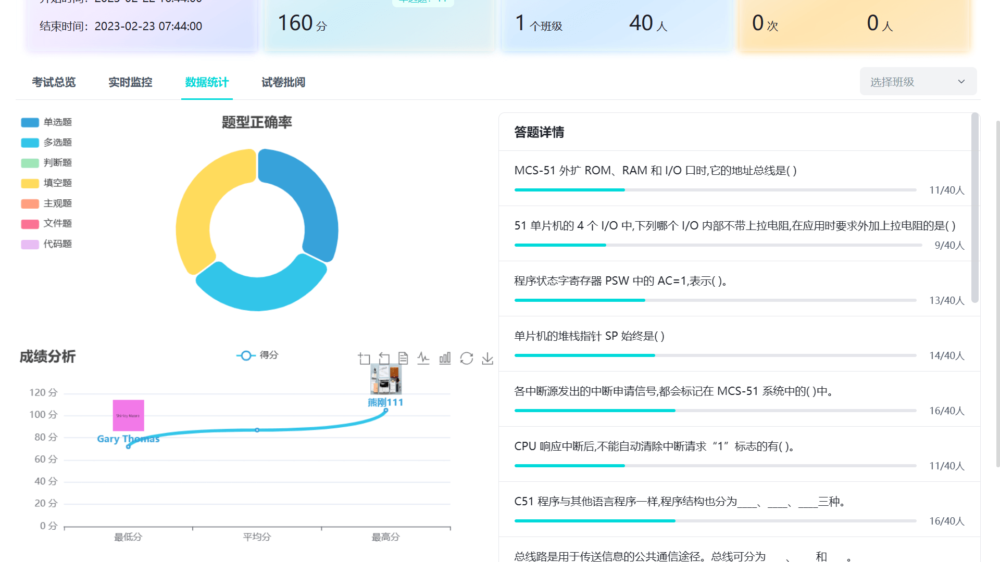</td>
        <td>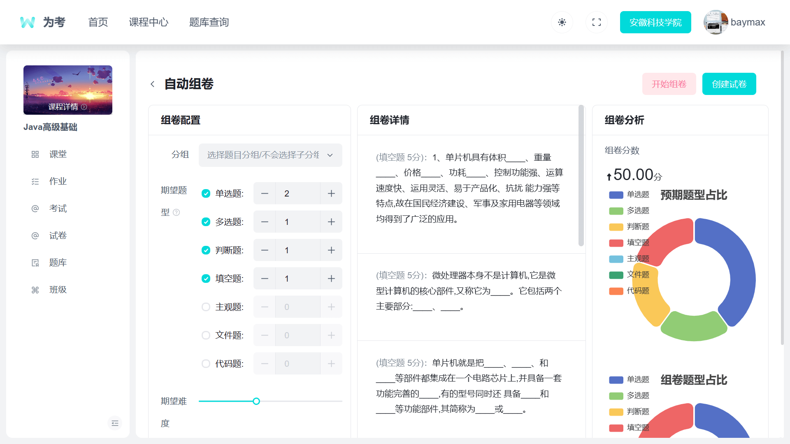</td>
        <td>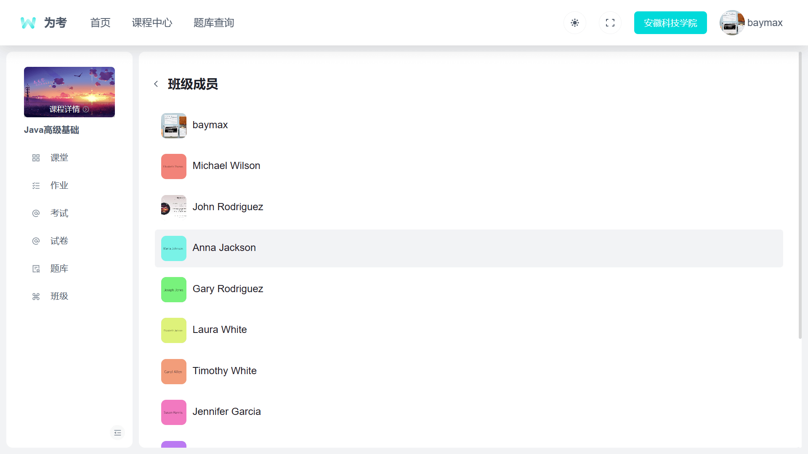</td>
    </tr>
</table>

### 系统

- 框架：SpringBoot、SpringCloud、Mybatis Plus、WebSocket
- 数据库：Mysql
- 缓存：Redis
- 前端：Vue 3、Vite、Pinia、Arco UI

### 功能图

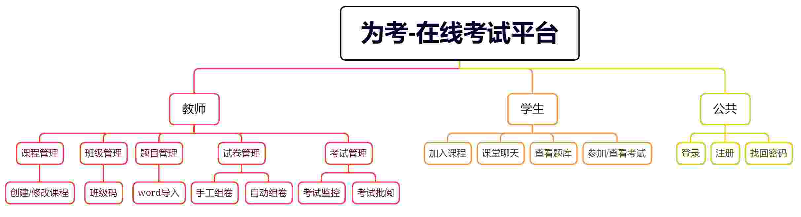

### E-R图
不知道画的对不对，记得上数据库实训的时候，给我那个博客画的E-R图，结果被老师训了一顿。到现在想起还有点害怕＞︿＜
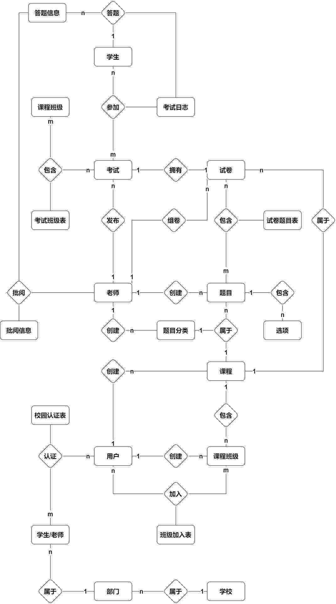

### 完成功能

- [x] 创建课程、添加课程、班级码加入课程
- [x] 创建班级、查看班级用户、分享班级码
- [x] 课堂互相实时聊天
- [x] 创建题库、题库树形分类
- [x] 创建题目（单、多、判、填、主观）、修改题目选项
- [x] 创建试卷、修改试卷、手动组卷、遗传算法自动组卷
- [x] 创建考试、修改考试
- [x] 考试控制台、考试概览、老师批阅、数据统计、考试监控
- [x] 参加考试
- [x] 行为监控
- [x] 实时消息通知
- [x] 考试数据导出
- [x] 考生数据统计分析
# 为考-前端
## 配置说明
根据实际环境，更改.env下的请求地址，如后台网关地址，图片资源地址
## 主题
如需更改主题，到下面的网站去制作主题，发布npm，然后把项目中的npm-`@arco-themes/vue-mgo-blog`包改了就行。
Arco UI:使用风格配置平台，轻松定制主题风格，从容应对各种业务需求。https://arco.design/themes

##  安装pnpm
```
npm install pnpm -g
```
##  安装依赖

```
pnpm install
```

## 运行项目

```
pnpm run dev
```

## 打包

```
//编译
pnpm run build 
```

# 为考后端

## 使用说明

### 下载和启动nacos

[nacos官网下载](https://nacos.io/zh-cn/)

```shell
startup.cmd -m standalone
```

### 更改配置
启动数据库：创建并导入本项目中sql目录下的sql文件。
启动`Redis,Nginx`

并修改项目中各个微服务`application.yml`中涉及的用户名和密码

### 本地测试
由于注册功能使用的是邮箱注册登录，在本地测试下如果没有配置邮箱功能，就不能注册，如需测试使用，请使用：

```text
用户名：baymax 密码：s123456
```

### 更改图片上传地址（如果一样的话就可以不用更改）
本地通过开启nginx服务进行静态访问。前端在.env文件中更改图片服务器的地址。

后端在`fte-service/fte-file-service/src/main/resources/application.yml`更该文件保存的路径，并启动`Nginx`服务器把该路径作为服务器逻辑。

> 如果更改了配置，记得在前端`.env`中更改图片地址，要不然图片加载不出来

``` text
#前端.env
VITE_FILE_PATH=http://localhost:10030
```
### 更换 公钥和私钥（可选）

```shell
keytool -genkeypair -alias jwt -validity 3650 -keyalg RSA -dname "CN=jwt,OU=jtw,O=jwt,L=zurich,S=zurich, C=CH" -keypass 12345 -keystore jwt.jks -storepass 12345
```
把这个文件放到认证服务器的resouces目录下

```shell
keytool -list -rfc --keystore jwt.jks | openssl x509 -inform pem -pubkey
```
复制公钥到资源服务器的resouces目录下，public.cert
### 更换邮箱和密码 （可选）

> fte-service/fte-mails-service/src/main/resources/application.yml

```text
  mail:
    #smtp服务主机  qq邮箱则为smtp.qq.com
    host: smtp.qq.com
    port: 587
    #服务协议
    #    protocol: smtps
    # 编码集
    default-encoding: UTF-8
    nickname: baymax
    #发送邮件的账户
    username: youremail 
    #授权码
    password: password
```

### 更换 第三方登录信息（可选）

> fte-service/fte-user-service/src/main/resources/application.yml

```text
justauth:
  enabled: true
  type:
    gitee:
      client-id: idorkey
      client-secret: idorkey
      redirect-uri: http://127.0.0.1:3030/uapi/public/user/login/GITEE/callback
    qq:
      client-id: idorkey
      client-secret: idorkey
      redirect-uri: http://127.0.0.1:3030/uapi/public/user/login/gitee/callback
    github:
      client-id: idorkey
      client-secret: idorkey
      redirect-uri: http://127.0.0.1:3030/uapi/public/user/login/github/callback
```


## 知识点总结
### 自动批卷
待补充
### 班级码生成
待补充
### 遗传组卷
主要思路参考：[GADemo](https://github.com/jslixiaolin/GADemo)，根据需求更改了大部分的逻辑，如初始化种群的时候根据配置，分配题型等

遗传算法是一种模拟自然界中生物进化过程的优化算法，它可以用来解决一些复杂的组合优化问题，比如自动组卷。自动组卷就是根据一定的规则和要求，从题库中选取合适的试题，生成试卷的过程。

遗传算法自动组卷的基本思想是：将每张试卷看作一个个体，每个个体由一串编码表示，编码中包含了试题的信息。然后对初始种群进行选择、交叉和变异等操作，产生新的种群，并根据适应度函数评价每个个体的质量。重复这个过程直到满足终止条件或达到最大迭代次数，输出最优或较优的个体作为最终试卷。
## 待完善功能

- [ ] 通过定时器，在考试开始前将考试信息放入缓存，考试结束后将未提交的自动提交
- [ ] 自定义第三方登录
- [ ] 校园认证
- [ ] 后台管理功能
